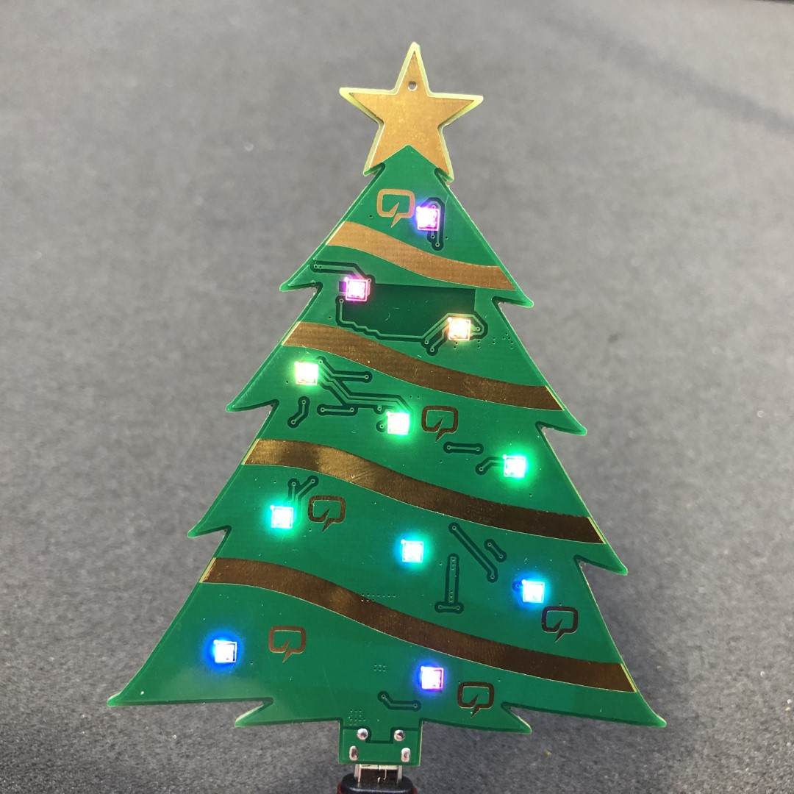

# Voltlog Smart Christmas Tree

This was my attempt at creating a smart Christmass tree decoration. I wanted to have a bunch of RGB LEDs that I could control remotely from my smart home automation system so I created this board using 11 x SK6812-EC20 RGB LEDs connected with an ESP32. The board can be flashed with an arduino sketch and have it flash various patterns in a standalone operating mode or you can flash it with esphome (or other similar platforms) and have it controlled from your smart home system.

More info about this project in [Voltlog #344](https://youtu.be/laZLzfCeY8s).
This was available in a limitted edition in the [Voltlog Tindie Store](https://www.tindie.com/products/voltlog/voltlog-smart-christmas-tree/).

